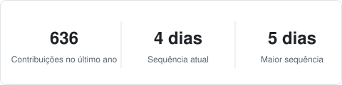

## 👋 Olá, eu sou o Gustavo Padilha

### 🚀 Desenvolvedor Full Stack | Python • FastAPI • Flask • Django • JavaScript

Construo sistemas completos, do banco de dados à tela. Na [TargetData](https://www.solucoesparadados.com.br/) trabalho em produtos de dados para consultas cadastrais e de compliance: as APIs que consultam as fontes de dados, a biblioteca compartilhada que padroniza esses dados, o painel web que o cliente usa e os relatórios em PDF que ele baixa. Por fora, desenvolvo software sob medida para pequenos negócios.

- **Front-end:** HTML, CSS, JavaScript, TypeScript, Jinja, Bootstrap
- **Back-end:** Python, FastAPI, Flask, Django, Celery, APIs REST
- **Dados:** MongoDB, OpenSearch, Redis, PostgreSQL, SQLite, pandas
- **DevOps:** Docker, Caddy, GitHub Actions
- **Testes:** pytest, ruff

### 🛠️ O que eu faço

- Aplicações web de ponta a ponta: APIs, painéis administrativos, lojas virtuais e dashboards
- Processamento e enriquecimento de grandes bases de dados em lote
- Relatórios em PDF com ReportLab
- Automação do meu fluxo de trabalho com agentes de IA (Claude Code)

### 📫 Contato

- [LinkedIn](https://www.linkedin.com/in/gustavo-padilha-8b8a511b6/)

### 📊 Contribuições no GitHub

Obrigado pela visita! 🚀
